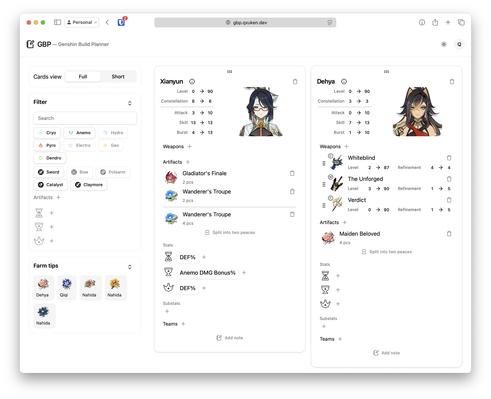
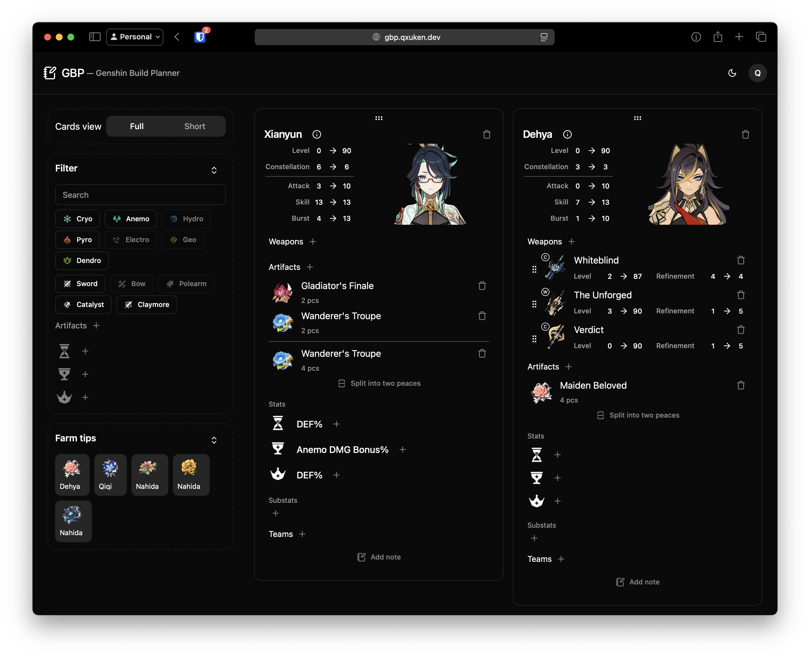

# Genshin Build Planner

A web application for planning and managing Genshin Impact character builds, weapon builds, artifact sets, and team compositions. The application features a Go backend powered by PocketBase and a modern React/TypeScript frontend.

| Light Mode                                | Dark Mode                               |
| ----------------------------------------- | --------------------------------------- |
|  |  |

## Self-Hosting / Deployment

Follow these steps to deploy your own instance of Genshin Build Planner. For development instructions, see the "Development Setup" section below.

### Step 1: Get the Application

You have two options: use the pre-built Docker image (easiest) or build from source.

#### Option A: Using Docker (Recommended)
This is the simplest way to get started. All you need is Docker installed.
```bash
docker pull qxuken/gbp:latest
```

#### Option B: Building from Source
If you prefer not to use Docker, you can build the application manually.
1.  Ensure you have Go and Node.js/npm installed.
2.  Run the build command from the root of the project directory:
    ```bash
    cd ./ui && npm run build && cd .. && go build .
    ```

### Step 2: Run the Application & Create Admin Account

Run the application. If using Docker, it is highly recommended to use a volume to persist your data.

```bash
# Example Docker command
docker run --name gbp -p 8080:8080 -v gbp_data:/pb_data qxuken/gbp:latest
```
*   `-p 8080:8080` maps the container's port 8080 to your host's port 8080.
*   `-v gbp_data:/pb_data` creates a persistent volume named `gbp_data` to store your database. This ensures your data is safe even if you remove the container.

On the first launch, the application will print a URL in the console logs. **Visit this URL in your browser to create your first admin account.** This link is only valid for a short time.


### Step 3: Configuration

Navigate to the "Settings" panel in the application to configure additional options, such as setting up an SMTP server for email features (like password resets).

> If you don't want to configure SMTP, you will need to disable the authentication rule. First, go to Settings > Application, uncheck "Hide collection create and edit controls," and click Save. Then, go to Collections > Users > Edit collection > API Rules, clear the "Authentication rule," and click Save. You will then be able to log in without verification.

### Step 4: (Optional) Upload Seed Data

> The docker images already seeded with game data (characters, weapons, etc.).

1.  **Get the `dump.db` file.** (See the ["Seed Data"](#seed-data) section below for download links).
2.  Log in to your new instance with the admin account you just created.
3.  Navigate to the `/dump` endpoint in your browser (e.g., `http://localhost:8080/dump`).
4.  Upload the `dump.db` file.

### Step 5: Done!

Your personal instance of Genshin Build Planner is now ready to use.

---

## Seed Data

The `dump.db` file contains all the necessary game data (characters, artifacts, weapons) required for the application to work. You only need to upload this once during the initial setup.

You can download the latest version from one of two places:
*   **From the Website:** Go to **[genshinbuild.app](https://genshinbuild.app)** and click the "Download Seed" button.
*   **From GitHub:** Download the `dump.db` file from the latest [GitHub Release](https://github.com/qxuken/gbp/releases/latest).

---

## Tech Stack

* **Backend:** Go with PocketBase framework
* **Frontend:** TypeScript, React, Vite
* **Database:** SQLite (via PocketBase)
* **Containerization:** Docker
* **Scripting:** Nushell

---

## Development Setup

This section is for developers who want to contribute to the project or modify the source code.

### Prerequisites

* Go 1.x
* Node.js & npm
* [Air](https://github.com/air-verse/air) for live-reloading the Go backend
  ```bash
  go install github.com/air-verse/air@latest
  ```

### Running in Development Mode

1. **Backend**
   First, ensure the frontend has been built at least once. Then, start the live-reload server.
   ```bash
   nu build.nu ui  # Run this the first time
   air
   ```

2. **Frontend**
   Navigate to the UI directory, install dependencies, and start the Vite dev server.
   ```bash
   cd ui
   npm install
   npm run dev
   ```

### Building & Publishing
The project includes Nushell scripts for building and publishing.
* **`build.nu`**: Builds the application.
* **`publish.nu`**: Builds and publishes multi-arch Docker images (arm64 & amd64). This is primarily for project maintainers.

> Important: there should be latest seed.db and seed.note for the images

  ```bash
  # Example: Build and publish a new version
  nu publish.nu
  ```

## TODO

Refer to [TODO.md](TODO.md) for a list of pending tasks and future improvements.

## License

This project is licensed under the MIT License - see the [LICENSE.md](LICENSE.md) file for details.
