# Atom Connections in the Project

This document visualizes the connections between atoms in the project using a Mermaid diagram.

## Atom Structure Diagram

```mermaid
graph TD
    %% Core Store
    store[store: jotai-store.ts] --> plansQueryAtom
    store --> plansAtom
    store --> themeAtom
    store --> actualThemeAtom
    store --> displayThemeAtom

    %% Plans Module
    plansQueryAtom[plansQueryAtom] --> plansAtom
    plansAtom[plansAtom] --> plansArrayAtom
    reorderMutationAtom[reorderMutationAtom] --> plansAtom
    plansArrayAtom[plansArrayAtom] --> weaponPlansAtom
    plansArrayAtom --> artifactTypePlansAtom
    plansArrayAtom --> artifactSetsPlansAtom
    plansArrayAtom --> domainsByArtifactSetsAtom

    %% Dictionaries Module
    elementsAtom[elementsAtom] --> elementsMapAtom
    specialsAtom[specialsAtom] --> specialsMapAtom
    characterRolesAtom[characterRolesAtom] --> characterRolesMapAtom
    weaponTypesAtom[weaponTypesAtom] --> weaponTypesMapAtom
    weaponsAtom[weaponsAtom] --> weaponsMapAtom
    charactersAtom[charactersAtom] --> charactersMapAtom
    artifactSetsAtom[artifactSetsAtom] --> artifactSetsMapAtom
    artifactTypesAtom[artifactTypesAtom] --> artifactTypesMapAtom
    domainsOfBlessingAtom[domainsOfBlessingAtom] --> domainsOfBlessingMapAtom

    %% Theme Module
    themeAtom[themeAtom] --> actualThemeAtom
    actualThemeAtom --> displayThemeAtom

    %% Filters Module
    plansArrayAtom --> availableFiltersAtom
    charactersMapAtom --> availableFiltersAtom
    filtersAtom[filtersAtom] --> filtersEnabledAtom

    %% Pending Plans Module
    plansAtom --> pendingCharacterPlansMapAtom

    %% Cross-module Connections
    charactersMapAtom --> filtersAtom
    domainsBySetAtom --> domainsByArtifactSetsAtom
    artifactSetsPlansAtom --> domainsByArtifactSetsAtom

    %% Styling
    classDef primary fill:#f9f,stroke:#333,stroke-width:2px;
    classDef secondary fill:#bbf,stroke:#333,stroke-width:2px;
    classDef tertiary fill:#bfb,stroke:#333,stroke-width:2px;

    class store primary;
    class plansQueryAtom,plansAtom,plansArrayAtom secondary;
    class elementsAtom,specialsAtom,characterRolesAtom,weaponTypesAtom,weaponsAtom,charactersAtom,artifactSetsAtom,artifactTypesAtom,domainsOfBlessingAtom tertiary;
```

## Atom Descriptions

### Core Store
- **store**: The main Jotai store instance that manages all atoms

### Plans Module
- **plansQueryAtom**: Query atom for fetching plans data
- **plansAtom**: Map of plans indexed by ID
- **plansArrayAtom**: Array of plans sorted by order
- **reorderMutationAtom**: Mutation atom for reordering plans
- **weaponPlansAtom**: Derived atom for weapon plans
- **artifactTypePlansAtom**: Derived atom for artifact type plans
- **artifactSetsPlansAtom**: Derived atom for artifact sets plans
- **domainsByArtifactSetsAtom**: Derived atom for domains by artifact sets

### Dictionaries Module
- **elementsAtom**: Observable atom for elements data
- **specialsAtom**: Observable atom for specials data
- **characterRolesAtom**: Observable atom for character roles data
- **weaponTypesAtom**: Observable atom for weapon types data
- **weaponsAtom**: Observable atom for weapons data
- **charactersAtom**: Observable atom for characters data
- **artifactSetsAtom**: Observable atom for artifact sets data
- **artifactTypesAtom**: Observable atom for artifact types data
- **domainsOfBlessingAtom**: Observable atom for domains of blessing data

### Theme Module
- **themeAtom**: Storage atom for theme preference
- **actualThemeAtom**: Atom for actual theme value
- **displayThemeAtom**: Read-only atom for display theme

### Filters Module
- **filtersAtom**: Immer atom for filters state
- **availableFiltersAtom**: Derived atom for available filters
- **filtersEnabledAtom**: Derived atom for enabled filters

### Pending Plans Module
- **pendingCharacterPlansMapAtom**: Immer atom for pending character plans

## Atom Types

The project uses several types of atoms:
- **Basic atoms**: Created with `atom()`
- **Storage atoms**: Created with `atomWithStorage()`
- **Immer atoms**: Created with `atomWithImmer()`
- **Query atoms**: Created with `atomWithQuery()`
- **Mutation atoms**: Created with `atomWithMutation()`
- **Observable atoms**: Created with `atomWithObservable()`
- **Derived atoms**: Created by deriving from other atoms

## Atom Usage Pattern

The project follows a pattern where:
1. Base atoms are created to store data
2. Derived atoms are created to transform or filter data
3. Map atoms are created to provide efficient lookups
4. Hooks are provided to access atoms in React components
