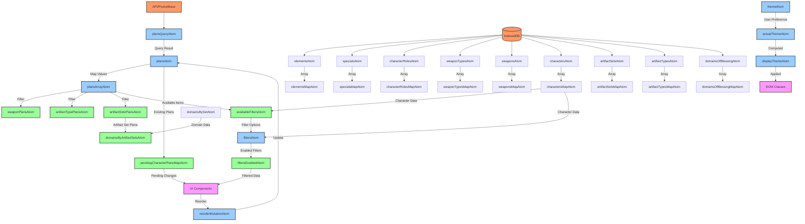

# Atom Data Flow in the Project

This document visualizes the data flow between atoms in the project using a Mermaid diagram.

## Data Flow Diagram

## Data Flow Explanation

### External Data Sources
- **API/PocketBase**: Provides plans data through queries
- **IndexedDB**: Local database that provides dictionary data (elements, characters, etc.)

### Core Data Flow
1. **plansQueryAtom** fetches data from the API
2. **plansAtom** stores the raw data as a map
3. **plansArrayAtom** transforms the map into a sorted array
4. Specialized atoms (**weaponPlansAtom**, **artifactTypePlansAtom**, etc.) filter the array for specific data

### Dictionary Data Flow
1. Base atoms (**elementsAtom**, **charactersAtom**, etc.) fetch data from IndexedDB
2. Map atoms provide efficient lookups by ID
3. These maps are used throughout the application for data references

### Theme Data Flow
1. **themeAtom** stores the user's theme preference
2. **actualThemeAtom** computes the actual theme based on system preferences
3. **displayThemeAtom** provides the final theme value
4. The theme is applied to the DOM through class names

### Filter Data Flow
1. **availableFiltersAtom** computes available filter options from plans and characters
2. **filtersAtom** stores the user's filter selections
3. **filtersEnabledAtom** computes which filters are active
4. Filtered data is passed to UI components

### Pending Plans Data Flow
1. **pendingCharacterPlansMapAtom** tracks changes to plans before they're saved
2. These pending changes are reflected in the UI
3. When changes are confirmed, they're saved to the backend

### User Interactions
1. User interactions in the UI trigger mutations (e.g., **reorderMutationAtom**)
2. Mutations update the base atoms
3. Changes propagate through derived atoms to the UI

## Atom Dependencies

The diagram shows how atoms depend on each other and how data flows through the application. Understanding these dependencies is crucial for:

1. Debugging state issues
2. Optimizing performance
3. Adding new features
4. Refactoring the codebase
